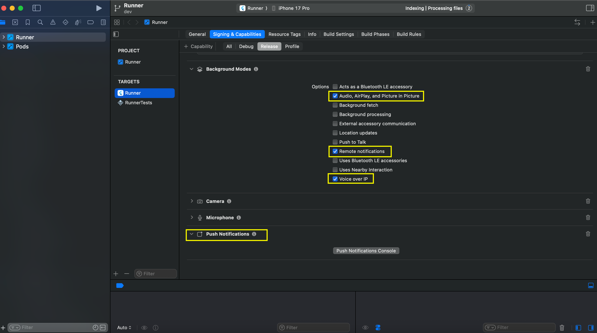
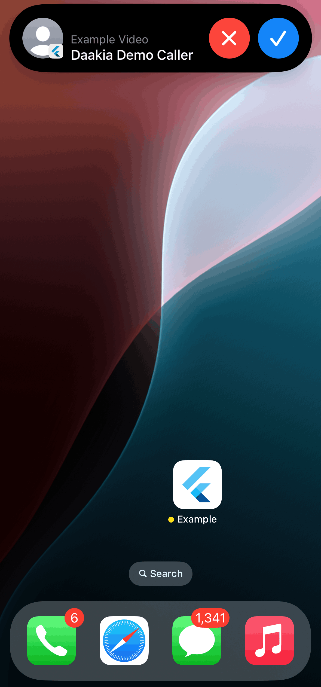
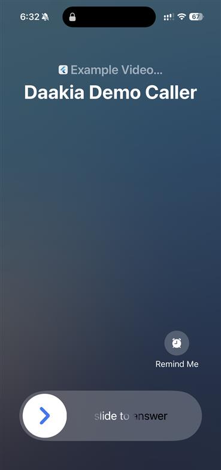

# iOS Setup

Use this guide when your app supports iOS incoming calls.

Skip this if your iOS app already has Push Notifications, Background Modes, APNs, and VoIP setup correctly configured.

## What You Will Finish With

After this guide, your iOS app should be able to:
- initialize the VoIP bridge
- receive PushKit / APNs-backed incoming call pushes
- present CallKit-backed incoming call behavior

## Important Reality Check

Real iOS incoming call validation requires:
- a signed physical iPhone
- correct Apple capabilities
- correct APNs credentials
- correct provisioning

Do not treat simulator behavior as final validation.

## Required Xcode Capabilities

Enable these in the iOS app target:
- Push Notifications
- Background Modes

Under Background Modes, enable:
- `voip`
- `remote-notification`
- `audio`

Reference screens:



## `Info.plist`

Ensure these background modes exist:

```xml
<key>UIBackgroundModes</key>
<array>
  <string>remote-notification</string>
  <string>voip</string>
  <string>audio</string>
</array>
```

## Entitlements

Your entitlements file must include the APNs environment:

```xml
<key>aps-environment</key>
<string>development</string>
```

Use `production` for release provisioning when appropriate.

## SDK Initialization Flow

Initialize the SDK first, then initialize VoIP:

```dart
await sdk.initialize(
  onIncomingCall: (payload) async {
    // Open your call UI.
  },
  onCallEvent: (event) async {
    // React to accepted / declined / ended / timedOut.
  },
);

await sdk.initializeVoip(
  onVoipTokenUpdated: (token) async {
    // Send token to your backend registration flow if needed.
  },
);
```

## Token Registration

For iOS, register the current push device. The SDK fetches the current FCM token and can include the VoIP token when available:

```dart
await sdk.registerCurrentPushDevice(
  username: 'current_user_id',
  platform: DaakiaPlatform.ios,
  voipToken: latestVoipToken,
);
```

## APNs And Firebase

If you use Firebase Cloud Messaging in the app, you still need the Apple push side configured correctly.

Use [ios-apns-firebase-linking.md](ios-apns-firebase-linking.md) for that part.

Result on device:




