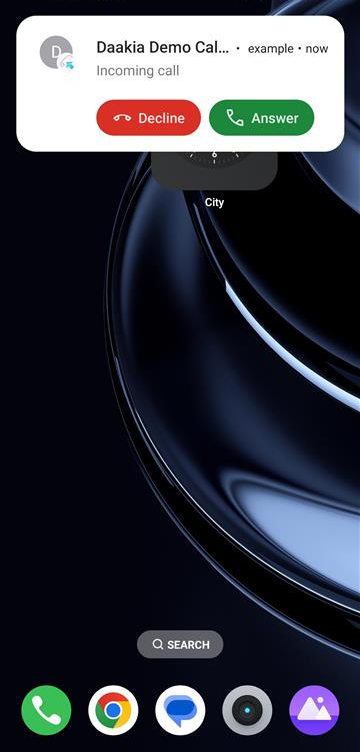
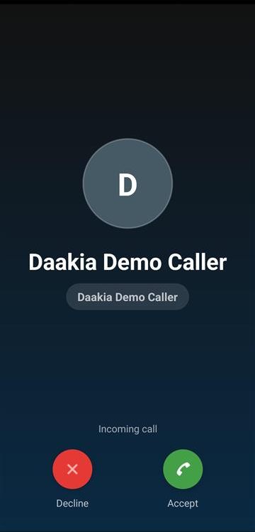
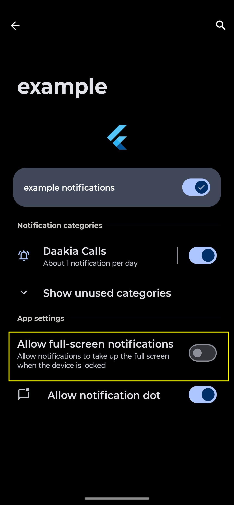

# Android Setup

Use this guide when your app supports Android incoming calls.

Skip this if your Android app already has equivalent push and full-screen notification setup.

## What You Will Finish With

After this guide, your Android app should be able to:
- receive FCM data messages for incoming calls
- show a full-screen incoming call notification
- open your incoming call UI from notification events

## Required Manifest Permissions

Add these permissions to `AndroidManifest.xml`:

```xml
<uses-permission android:name="android.permission.INTERNET" />
<uses-permission android:name="android.permission.POST_NOTIFICATIONS" />
<uses-permission android:name="android.permission.USE_FULL_SCREEN_INTENT" />
<uses-permission android:name="android.permission.VIBRATE" />
```

## Recommended Activity Flags

Your main activity should allow lock-screen presentation:

```xml
<activity
    android:name=".MainActivity"
    android:exported="true"
    android:launchMode="singleTop"/>
```

Result on device:





## Background Message Handler Is Required

Foreground-only FCM handling is not enough.

For Android incoming calls delivered as FCM data messages, the host app must register a top-level background handler:

```dart
@pragma('vm:entry-point')
Future<void> firebaseMessagingBackgroundHandler(RemoteMessage message) async {
  WidgetsFlutterBinding.ensureInitialized();

  if (Firebase.apps.isEmpty) {
    await Firebase.initializeApp(
      options: DefaultFirebaseOptions.currentPlatform,
    );
  }

  if (message.data.isEmpty) return;

  final notifications = DaakiaNotificationService();
  await notifications.initialize();
  await notifications.showIncomingCallNotificationFromData(
    Map<String, dynamic>.from(message.data),
  );
}

Future<void> main() async {
  WidgetsFlutterBinding.ensureInitialized();
  FirebaseMessaging.onBackgroundMessage(firebaseMessagingBackgroundHandler);
  runApp(const MyApp());
}
```

This part cannot be fully hidden inside the package because `firebase_messaging` requires the background entrypoint to live in the host app.

## Also Handle Notification Re-entry

For better app behavior after a notification tap, also handle:
- `FirebaseMessaging.onMessageOpenedApp`
- `FirebaseMessaging.instance.getInitialMessage()`

## Android 14 And Above

On Android 14+, manifest setup alone may not be enough for full-screen incoming call UI.

Use the SDK helper to check and open settings if needed:

```dart
if (!await sdk.notifications.canUseFullScreenIntent()) {
  await sdk.notifications.openFullScreenIntentSettings();
}
```

Example settings screen:



## Delivery Expectations

For the most reliable incoming call wake-up behavior, the backend should send:
- high-priority FCM data messages
- the expected incoming call payload fields

## Short Testing Checklist

1. Install the app on a real Android device.
2. Grant notification permission.
3. Initialize the SDK.
4. Register the current FCM token.
5. Send an incoming call push while the app is:
   - foreground
   - background
   - locked
6. Verify full-screen incoming call UI appears.

## Common Android Failure Pattern

If calls work only when the app is open, the first thing to verify is the background message handler.
