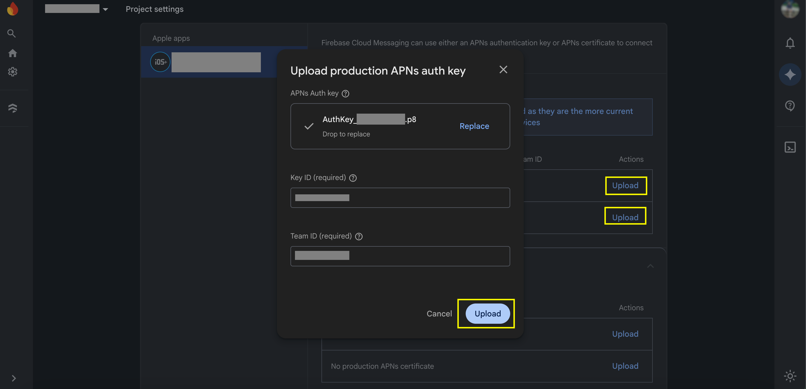

# Firebase Setup

Use this guide when Firebase is not already configured for the app.

Skip this if your app already has working Firebase Messaging setup.

## What You Will Finish With

After this guide, your app should have:
- a Firebase project
- Android and/or iOS apps registered in Firebase
- config files added to the Flutter app
- Firebase Messaging available for token retrieval and push delivery

## Official Docs

- FlutterFire setup: https://firebase.google.com/docs/flutter/setup
- FCM for Flutter: https://firebase.google.com/docs/cloud-messaging/flutter/client

## Steps

1. Create or select the Firebase project.
2. Add your Android app using the exact Android package name.
3. Add your iOS app using the exact iOS bundle identifier.
4. Download the config files:
   - Android: `google-services.json`
   - iOS: `GoogleService-Info.plist`
5. Place the files in the correct app locations.
6. Ensure your Flutter app initializes Firebase before using messaging.

If your iOS app is already added in Firebase, the APNs upload area will look similar to this:



## App File Placement

Android:
- place `google-services.json` in `android/app/`
- in the example app, the file would go in `example/android/app/`

iOS:
- add `GoogleService-Info.plist` to the iOS Runner target in Xcode
- in the example app, the file would go in `example/ios/Runner/`

## Code Initialization

Initialize Firebase before any SDK usage:

```dart
Future<void> main() async {
  WidgetsFlutterBinding.ensureInitialized();

  await Firebase.initializeApp(
    options: DefaultFirebaseOptions.currentPlatform,
  );

  runApp(const MyApp());
}
```

If you also support Android background call pushes, register the background handler before `runApp()`.

## Important Notes

- `daakia_callkit_flutter` does not replace Firebase setup.
- The host app still owns Firebase project configuration.
- If Firebase is not configured correctly, token fetch and background push handling will fail.

## When Screenshots Help

Add screenshots here only if your team repeatedly misses one of these steps:
- adding the iOS app to Firebase
- downloading the correct config file
- adding `GoogleService-Info.plist` to the Runner target
