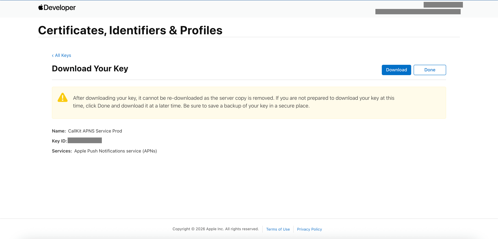
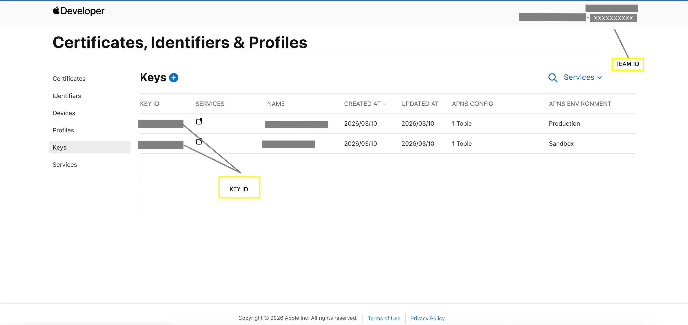

# APNs And Firebase Linking

Use this guide when connecting Apple push credentials to Firebase and the backend.

This is the part most teams confuse, so keep it separate from the SDK usage guide.

## What You Will Finish With

After this guide, your project should have:
- valid Apple push credentials
- Firebase configured for your iOS app
- clear environment mapping for sandbox and production

## What You Need

From the client or app owner:
- Apple Team ID
- Apple `.p8` key file
- Apple Key ID
- iOS bundle identifier
- Firebase project ID
- APNs environment decision: sandbox, production, or both

Review [client-handoff.md](client-handoff.md) first if these are not ready.

## Official References

- Firebase iOS Cloud Messaging: https://firebase.google.com/docs/cloud-messaging/ios/client
- Apple Push Notifications: https://developer.apple.com/documentation/usernotifications/registering_your_app_with_apns

## Recommended Flow

1. Create or reuse the Apple push key for the correct Apple account.
2. Record the Apple Team ID and Key ID.
3. In Firebase Console, open the iOS app settings.
4. Upload the APNs authentication key.
5. Confirm the bundle ID matches the iOS app in Firebase and Apple.
6. Confirm the backend team has the environment mapping it expects.

The same APNs auth key can be used for both sandbox and production if the backend is built that way. Even then, document the environment mapping explicitly so there is no ambiguity.

Reference screens:

## Environment Mapping For This SDK

- iOS sandbox uses `config_name: dev`
- iOS production uses `config_name: prod`

If your backend stores different credentials per environment, this mapping must match the backend configuration.

## VoIP Note

If your backend uses separate VoIP push handling, confirm that the backend team also has the required VoIP credential setup. Keep standard APNs setup and VoIP setup clearly documented as separate concerns.

## Screenshot Scope

These screenshots are included because this is the part teams most often misconfigure. Avoid adding more unless they explain a different step.
